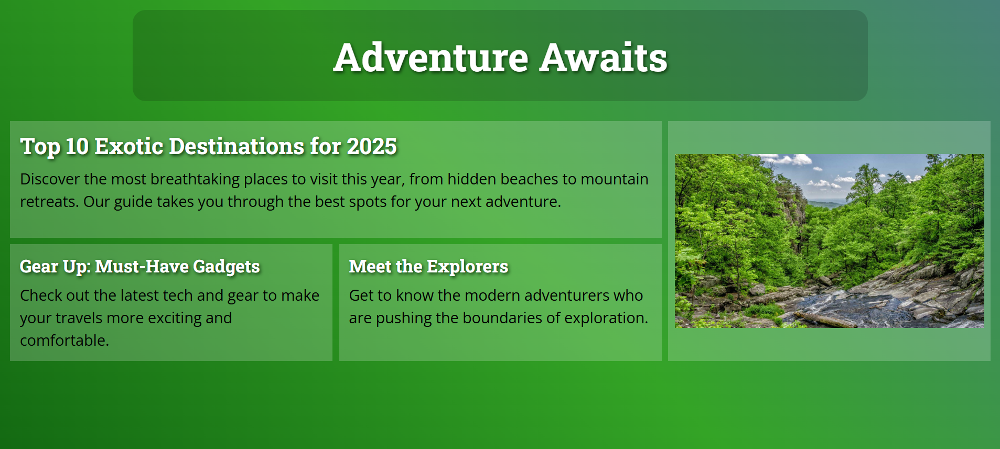

# 💻 Magazine Layout

## ℹ️ A Simple Magazine Layout Page

This project features a stylized digital magazine layout designed with semantic HTML and modern CSS techniques. The layout mimics a real magazine cover, complete with a title, featured article, smaller stories, and a prominent image section.

It was built entirely with HTML and CSS as part of the [**freeCodeCamp.org**](https://www.freecodecamp.org/learn/full-stack-developer/) CSS course.

---

## 🔍 Overview

The magazine layout project uses CSS Grid to structure content into a professional three-column, two-row format. Each section is styled with visual hierarchy, text-shadow effects, and a blended background gradient to evoke a premium editorial feel.

The design adapts well to various screen sizes while preserving the layout integrity, making it a solid introduction to visual composition and responsive design principles.

---

## ✨ Features

- Full CSS Grid layout with defined grid areas
- Semantic HTML5 elements for proper document structure
- Custom Google Fonts for typographic variety
- Gradient background image applied via CSS
- Text shadow and transparency overlays for visual emphasis
- Optimized image display using `object-fit: cover`
- Fully responsive and accessible structure

---

## 🧠 What I Learned

- How to implement complex grid layouts using `grid-template-areas`
- Managing consistent visual rhythm with `clamp()` font sizing
- Applying layered gradients and text shadows for design polish
- Structuring HTML content semantically to aid readability and accessibility
- Styling layouts that maintain responsiveness without media queries
- Practicing component organization with clearly defined CSS variables

---

## 🛠️ Tech Used

- HTML5
- CSS3
- Git
- GitHub
- Netlify

---

## 🚀 How to Run

1. Clone the repository
2. Open `index.html` in your browser

---

## 🌐 Live Demo

Or you can check out the 👉 [live website here](https://magazine-layout-fcc-jiro.netlify.app/)

---

## 🧑‍💻 Author

Created by **Elmar Chavez**

🗓️ Month/Year: **May 2025**

📚 Journey: **2nd** month of learning _frontend web development_.
